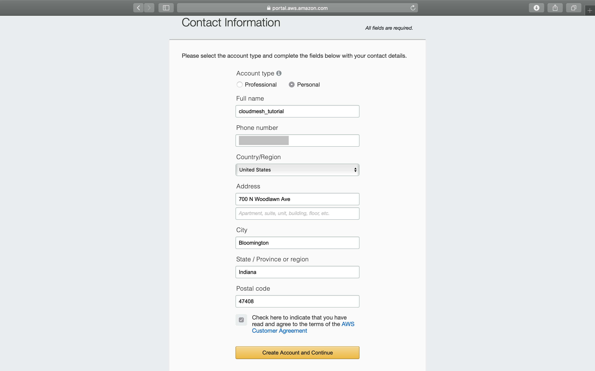
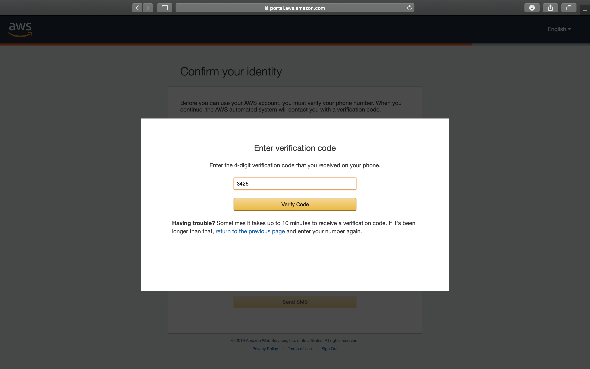
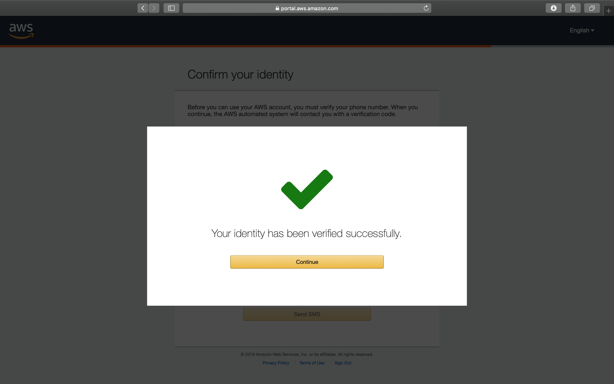
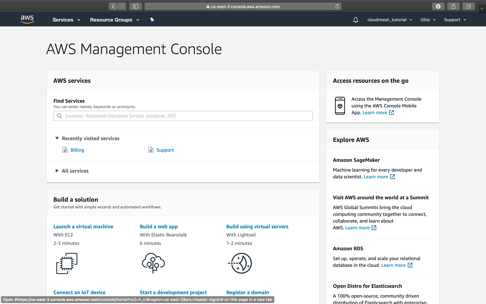

# Amazon Web Services (AWS) Account Creation Tutorial

Amazon Web Services provides a wide variaty of cloud-based products including analytics, application integration, AR and VR, cost management, blockchain, business applications, compute, customer engagement, database, developer tools, end user computing, game tech, IoT, machine learning, management and governance, media services, migration and transfer, mobile, networking and content delivery, robotics, satellite, security, identity and compliance, and storage. Here at cloudmesh, we develop services through providers to support your utilization of many of these products. 

* **Amazon Elastic Compute Cloud (EC2)** Amazon EC2 is web service that enables users to perform elastic web-scable computing while having complete control over instances. It is integrated with most AWS services such as Amazon S3, RDS, and VPC.

* **Amazon Simple Storage Service (S3)** Amazon S3 an object storage service that offers a wide range of storage classes.

This page is a step-by-step guide on how to create an AWS account. 

## Registration

First, we go to the AWS website: <https://aws.amazon.com>. Click on `Create an AWS Account`.

This will direct you to the account creation page. Fill out your information and click `Continue`. 

At this page, you will need to fill out your contact information. You can choose `Professional` or `Personal` as your account type. Here in this tutorial, we selected `Personal`. Read the *AWS Customer Aggrement*, and check the box if agreed. Click on `Create Account and Continue` to continue.

Fill out your payment information and proceed. 

> We will not charge you unless your usage exceeds the AWS Free Tier Limits.  - Amazon AWS

Next your need to confirm your identity. You can choose either `Text message (SMS)` or `Voice call` to receive your verification code. Here we choose `Text message (SMS)`. Enter your phone number and the security check code and click `Send SMS`. 

Enter the 4-digit verification code you received from your phone, and click on `Verify Code`. 

If you entered the correct verification code, you will see this page. Click on `Continue`. 

You will need to choose your support plan. For the tutorial, we chose Amazon's free tier `Basic Plan`. 

Congratulations! You have successully created an AWS account. Now you can click on `Sign In to the Console` to sign in.

Enter the email address you used for registration, and click on `Next`. 

Enter the password you used for registration, and click on `Sign In`. 

Now you've successfully signed in to the AWS Management Console. 

You can click on `Services` to explore AWS services through their GUI interface. 

You can also start managing your account and instances through our cloudmesh services! :)

## References

* <https://aws.amazon.com/?nc2=h_lg>

* <https://aws.amazon.com/ec2/?nc2=h_m1>

* <https://aws.amazon.com/s3/?c=23&pt=1>
