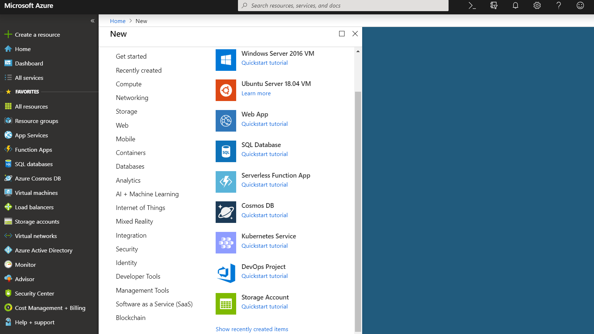

# Azure Blob Storage and Account Creation

## Azure Blob Storage

Azure Storage is Microsoft's cloud storage solution for modern data 
storage scenarios. Azure Blob storage is Microsoft's object storage 
solution for the cloud. Blob storage is optimized for storing massive 
amounts of data. 

Blob storage offers three types of resources:

* The storage account.
* A container in the storage account
* A blob in a container

## Azure Storage account creation

Following are the steps to create Azure storage account

* Prerequisites

Create a free Azure cloud services subscirption account.

* Login to Azure Portal

* Log in to the [Azure Portal](https://portal.azure.com/). 

{#fig:az-portal}

* In the Azure portal, click on `Create a resource` on the top left corner

{#fig:az-resource}

* Select `Storage Account` from the options shown in @fig:az-resource

{#fig:az-account}

* Select the subscription in which to create the storage account.

* Under the `Resource group` field, select Create new. Enter a name for your 
  new resource group.
  
* Next, enter a name for your storage account.

* Select a `location` for your storage account, or use the default location.

* Select `create`

After the completion of above steps, Azure blob storage service will be ready 
for use. As a firt step, a `Container` should be created in the Blob storage. 
A container organizes a set of blobs, similar to a directory in a file system. 
A default `Container` should be set in the `cloudmesh4.yaml` file details  of 
which are outlined 
[here](https://github.com/cloudmesh/cloudmesh-manual/blob/master/docs-source/source/configuration/configuration.md)

**IMPORTANT NOTE:**

The free Azure account needs to be upgrade to a pay-as-you-go subscription 
after first 30 days to get continued access to free products—some for the 
first 12 months.

Refer to more details here - <https://azure.microsoft.com/en-us/free/>

## References

* <https://docs.microsoft.com/en-us/azure/storage/common/storage-introduction>

* <https://docs.microsoft.com/en-us/azure/storage/blobs/storage-blobs-overview>

